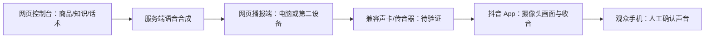

# 抖音 App 实景 + 网页 AI 播报

2026-09-28。本次路线按用户最新决定：抖音 App 负责开播、真实摄像头画面与收音，网页负责 AI 音频。没有实现或引入视频推流、原生手机 App、第三方签名服务。

## 已落地的软件路径

1. 语音：当前门店样本经预签名 URL 上传；服务端保存授权文本、确认时间、操作人、对象位置。可试听原样本、重命名、删除。克隆与合成通过可替换 `VoiceProvider`；第一实现为 DashScope CosyVoice，未配置账号时不会返回克隆成功。
2. 播报：**声音直接在直播控制台页面播放**（2026-10-04 起）。点击“开始本场”或工作台的“开始播报”时，页面在这次点击里解锁 Web Audio，向后端领取一张限定租户/场次、带有效期的播报凭证，再连上播报 WebSocket（心跳、断线重连）。控制台不再有接法选择、配对链接和试听确认；页面刷新后重新点“开始播报”，接着播还没播的内容。同一场只有最新领取凭证的页面在播，旧页面会停下。测试音是服务端生成的提示音，不冒充 TTS。三种命令为 APPEND、INTERRUPT、CLEAR_REPLAY，同 ID 去重。
   独立播报页 `/player` 的代码和路由仍在，协议相同，但控制台目前不生成它的链接；手机或第二台设备播报留待后续开发，下面的“手机与接线矩阵”也是为那一步准备的。播报只在直播页面打开时进行，切到其他页面会停止。
3. 弹幕回复（2026-10-05 起含语义匹配与 AI 回答，见“弹幕回复”一节）：网页版控制台里唯一的弹幕来源是手动输入的模拟弹幕，**没有接抖音官方的弹幕接口**。真实弹幕只有在桌面端里打开控制台时才有：由桌面软件读取商家自己的直播间，试用阶段，见“桌面端读取弹幕”。

**整段一次合成，只在句子开头插播**（2026-10-05 起）。一段话术作为一次请求发给供应商，同时打开 `word_timestamp_enabled`：供应商随音频返回每个字（含标点）在第几毫秒读出。服务端在返回的文字里找出每句话的开头（句号、问号、感叹号之后；超过 40 字的长句也算逗号之后），再到对应时间前后 80 毫秒的实际波形里找最安静的 10 毫秒作为插播点，音量仍高于满幅 0.02 的位置不用。播放器只在这些位置插播回复，回复播完后从同一位置接着讲。回复本身不会被打断。

**回复优先于讲解**（2026-10-05）：

- 回复合成好之后，在讲解的下一句开头插进去。前提是那里之后这一段还剩 5 秒以上；不到 5 秒回头再接着讲不值得，就让这一段讲完，回复紧跟着播。（2026-10-05 试过把这个界限降到 2 秒，随后按产品决定改回 5 秒。）
- 两段讲解之间的停顿里，下一段已经排好但还没出声，这时回复到了就先播回复，那一段原样放回去等着。
- 有几条回复在等就连着播完，播完才回到讲解。连着播时中间的“接着说”不说，只有最后一条说。
- 没有句子位置信息的片段（供应商没返回时间、或整段只有一句）仍然只能等它讲完。

几点要知道：

- 返回的文字是供应商**读出来的形式**，不是提交的原文：“9.9”变成“九点九”，空格变成“、”。所以位置是在返回的文字里找的，不从原文推算。
- 供应商没有返回时间信息时（换了不支持的模型，或把一段文字拆成了多个“句子”——后一种情况的时间基准没有验证过，一律不用），退回到只按音量找停顿，位置可能落在句子中间。
- 整段音频首尾的静音会裁掉，只留 30 / 40 毫秒余量，这样片段之间的停顿完全由播放器决定。裁剪阈值是 10 毫秒窗口 RMS 低于满幅 0.002。
- 句与句之间的停顿是供应商合成时自己带的，本系统不再增减。

实测（2026-10-05，`cosyvoice-v3.5-flash`，克隆音色，本机到北京地域，各一次）：

| 内容 | 音频时长 | 从提交到拿到整段 | 结果 |
|---|---|---|---|
| 105 字讲解 | 19.8 秒 | 8.2 秒 | 4 个句子开头全部找到插播点；其中 2 处是 330–430 毫秒的真实停顿，另 2 处主播没有停顿，切在两个字之间 10–30 毫秒的低谷里 |
| 回复 + 过渡语，共 34 字 | 6.0 秒 | 3.6 秒 | 过渡语的起点落在 420 毫秒的停顿里 |

单次请求里，连接约 1.3 秒、到第一段音频约 2.5 秒，这部分开销与文字长短无关。中间试过逐句合成再拼接（每句一次请求），句子位置同样准确，但每句都要付一遍这笔开销，而且每句结果首尾各带 0.4–0.9 秒静音，已放弃。上表只是各一次的结果，没有统计过波动，也没有换音色验证。

**停顿由播放器加在片段之间**：两段讲解之间 0.6–1.2 秒，回复开口前 0.3–0.5 秒，回复之后 0.35–0.6 秒，都在范围内随机。停顿排在音频时钟上，加载和解码花掉的时间算在里面；队列空了一阵之后来的片段、暂停后继续，都不再额外等待。这些数值是凭经验定的，**没有在真实直播里试听调校过**。

供应商 WS 接口按流接收 PCM；**本版整段合成完再下发 WAV**，网页尚不是逐块首包播放。因此 `firstAudioMillis` 是服务端提交文本到收到供应商第一片音频的内部指标，不是用户要求的“文本提交到浏览器首段出声”。首段出声还需整段合成、下载、解码与队列等待。分段输入可缩短第一段等待；没有实测数据时不承诺秒数。

目前支持手动提交经过确认的话术并连续排队，也支持自动讲解（2026-10-04 加入，见下节）。尚未在真实直播间长时间运行过，不应当作无人值守商用已验收版。

## 自动讲解

在直播工作台开启后，系统按本场商品顺序循环讲解，每件商品走一遍“开场 → 痛点 → 细节 → 促单收尾”，具体环节取自配置里的话术风格（选了“不展开”则跳过痛点）。

- **话术来源**：文案模型（`TEXT_WRITER` 能力，经 AI 网关调用）只拿到商品库里保存的名称、售价、规格、优惠、核心卖点和已启用问答。未配置文案模型时自动讲解直接停止并说明原因，不用占位内容顶替。
- **文案模型要关掉思考模式**：2026-10-04 用通义千问 `qwen3.8-flash` 实测，同一段口播默认参数耗时 25 秒、其中 1391 个输出 token 是思考；加 `enable_thinking=false` 后 4.4 秒、86 个输出 token。默认状态下生成比播放慢，会出现一段播完、下一段还没好。通过 `TEXT_WRITER_EXTRA_BODY` 把供应商的开关并入请求体，例如 `{"enable_thinking":false}`。每次调用的耗时和思考 token 数会写进后端日志（`文本模型调用完成`）。
- **事实校验**：生成结果播出前做机械检查——出现资料里没有的数字、用汉字写的金额或折扣、资料未写的承诺（包邮、限时、无理由、保修等）或绝对化用语时，要求模型重写一次，仍不合格则跳过这一段。价格的口语说法算作同一个数：资料写 12.9，话术说“12块9”“12块9毛”“12元9角”“12点9”都通过（2026-10-06 修正；此前这些会被拆成 12 和 9 两个数而误拒，报“出现了商品资料里没有的数字 12”）。被拒的原文不落库，记在 worker 日志里（`直播话术未通过校验` / `直播弹幕回复未通过校验`）。这是对常见情况的过滤，不是合规保证：换一种说法绕开上述模式的内容检查不出来。
- **低水位补充**：始终保持 3 段已合成、待播的讲解。播完一段才写下一段，生成速度由实际播放决定；播报设备不在线时备好 3 段后停下。没有定时轮询，每次补充都由事件触发（开启、播完、合成完成、继续本场）并作为任务执行。
- **段与段的衔接**：写新一段时会带上刚讲完那一段的结尾。同一件商品中间的环节要求紧接着往下讲，不打招呼、不以“家人们”这类称呼开头（模型没照做时开头的称呼会被去掉）；每件商品的开场环节另起话头，可以顺带招呼新进来的观众。提示词还要求每句不超过 35 字并用句号断句，这样才有地方插播。
- **防重复**：开启“话术防重复”时，写新一段会带上同一商品最近讲过的 3 段，要求换角度表达。
- **主播与助播**：每场一个主播，可以再设多个助播。设了助播后，自动讲解每讲完一件商品的一轮换下一个声音，从主播开始。手动播报始终用主播音色。
- **弹幕由助播回答**（可选，默认关，2026-10-05 加入）：在“话术与知识库”里打开后，观众的提问由最先设为助播的那一位回答，答完不说过渡语，直接换回主播的声音。这位助播不再参与轮流讲解，这样回答的声音一定和正在讲解的声音不同；其余助播照常轮流。没有助播时开关不起作用，仍由主播回答。和其他配置一样开播后锁定。提示词里的身份改为助播，并且不带主播的称呼。
- **人设**：主播称呼（12 个以内的汉字或字母）和说话风格（亲切自然、热情活力、专业沉稳、幽默轻松四选一）会写进话术提示词。不接受任意文字，不认识的风格和不合规的称呼直接忽略。
- **自动停止**：连续 3 次生成或合成失败会自动停止并显示原因；每场每 10 分钟最多生成 60 段。停止后不再写新内容，已下发到播报端的片段会播完。

## 弹幕回复

每条弹幕落一行在 `live_comments`，工作台的“弹幕流与 AI 回复”读的就是它。接口只负责记下来并提交任务 `LIVE_REPLY_GENERATE`（队列 `LIVE`）；回不回、怎么回，都在 worker 里决定。没有用向量检索（RAG）：本场问答（最多 60 条）和商品资料整个放进提示词。等一家店的问答多到放不下时才需要检索。

**先判断这条弹幕是哪一类，再决定怎么回应**。最初每条弹幕都被当作提问，一句“绿豆不错 去火”会被套到“能去冰吗”上；随后改成“是不是提问”，又太窄：“我想喝牛奶冰”被当成闲聊放过，“上次喝了拉稀”被悄悄跳过。2026-10-05 起分四类：

| 类别 | 是什么 | 怎么处理 |
|---|---|---|
| 提问 | 想了解本场商品、门店或怎么买；问是不是录播、是不是实时直播 | 依据问答和资料回答；资料不够不答，记入“没答上的问题” |
| 想买 | 说想买、想要、想试试，或在犹豫 | 接住观众的话，带一句资料里写明的价格或卖点，引导下单 |
| 转人工 | 投诉、说吃了不舒服、要求退款赔偿、质疑安全或真假 | **AI 不回**。弹幕流里用红框标出“需要人工处理”和事由，等人处理 |
| 其他 | 夸奖、闲聊、说自己的喜好、与本场无关；问主播是不是真人、是不是 AI、是不是机器人、声音是不是合成的 | 不回 |

具体流程：

1. **和某条问答的问题文字一致**（去掉空格和标点后相同）：不需要判断。调一次模型把商家写的回答改成口语（不开思考，约 1–2 秒），要求意思、数字、承诺不变。模型没配置、调用失败、或改写两次都没通过检查时，按商家原话播出。
2. **其余的**：调一次模型（打开思考），输出一个 JSON：属于哪一类、一句话概括、依据的是哪条已有问答、要说的话。提示词明确：比对问答时字面相近不算；可以对资料做最直接的理解（商品名里写着牛奶就是含牛奶），但不补充资料里没有的事实；涉及过敏、怀孕等健康顾虑只说明成分并提醒谨慎，不作“可以喝”的保证；不说“资料里写了/没写”这类话。
   
   “转人工”一类无论模型写了什么都不播。其余要说的话都要过机械检查（资料里没有的数字、金额、承诺、绝对化用语），不合格重写一次，仍不合格不播。观众自己打出来的数字不算资料。

弹幕的六种结果：正在回答、已回复、未回复（资料不够、校验没过、过于频繁、场次已结束、等待超时）、回复失败（模型没配置或输出读不懂）、无需回复、需要人工处理。

**关于直播方式的提问**（2026-10-05）：

- 问是不是录播、是不是实时：如实回答。提示词里固定带一句【直播间情况】“这是实时直播，不是录播，画面是现场实时拍摄的”，模型据此用口语回答。这句话对本产品的开播方式（抖音 App 用摄像头开播）成立；如果商家用别的方式放录好的画面，它就不成立了，系统无从得知。
- 问是不是真人、是不是 AI、是不是机器人、声音是不是合成的，以及一切关于主播是谁、是什么的话：**一律不回，两种说法都不出现**（2026-10-05 的产品决定）。归入“其他”，弹幕流里显示“无需回复”，不标红。曾有需求让这类提问一律回答“是真人在播”，没有做：回答的声音是 AI 合成的，那等于让系统对观众说假话。
- 硬检查：模型写出的任何回复（包括把商家回答改成口语的那一步）只要提到“真人”“本人在播”“人工在播”“AI”“人工智能”“机器人”“数字人”“虚拟人”“合成的声音”，一律不播；第一次要求重写，第二次仍然如此就放弃。商家自己写的问答原文和手动播报不在这道检查之内，那是商家自己说的话。

**商家的回答不再原样播出**。播出的是模型改成口语的版本，只有上面第 1 步的几种失败情况才播原话。这是 2026-10-05 的产品决定：原话多是“不能 本身就是沙冰”这类备注式短句，念出来生硬。代价是播出内容不保证逐字是商家写的，把关靠机械检查。

**思考开关**。判断这一步通过 `TEXT_WRITER_REASONING_EXTRA_BODY` 打开模型的思考（通义千问填 `{"enable_thinking":true}`）；留空则和写口播一样不思考。2026-10-05 用 `qwen3.8-flash` 在一场真实资料（4 条问答、2 件商品）上各跑了 14 条弹幕，每种设置一次：

| | 打开思考 | 不思考 |
|---|---|---|
| 单条耗时 | 2.5–14.4 秒，多数 5–6 秒 | 0.8–2.0 秒 |
| 夸奖、闲聊、“忽略以上规则…”（5 条） | 全部判为不回 | 全部判为不回 |
| 换了问法的已有问答（3 条） | 全部对上 | 全部对上 |
| “牛奶过敏”“有没有红豆冰” | 依据商品名称和本场商品作答 | 判为资料不足，不答 |
| “两张多少钱” | 不答（不自己算价格） | 答了单价并说“我给您算一下” |

这张表是用上一版“是不是提问”的提示词测的。改成四类之后只在打开思考的设置下重测过：20 条弹幕，“我想喝牛奶冰”“看着不错 有点想买”判为想买并给出带价格的引导；“上次喝了拉稀”“我要退款”“主播是真人吗”“是不是录播”判为转人工；“牛奶过敏咋整”“孕妇能喝吗”答的是“含牛奶，有顾虑的朋友谨慎选择”；耗时 2–17 秒。每种只跑了一轮，没有统计过波动。

四类提示词在不思考的设置下也测了一轮（24 条，单条 1.2–3.1 秒，平均 1.9 秒）：投诉、退款、想买、身份类的分类全部正确；“杨枝甘露好喝还是绿豆冰好喝”被当成闲聊放过；两条想买的回复把价格说成“9块9”被数字检查拦下要重写；“怎么买”答了资料里没有的“点下方小黄车”；“孕妇能喝吗”的措辞生硬。打开思考时这几条没有这些问题。

**回复有自己的通道，不和讲解排队**（2026-10-05）。此前回复的“判断”和“合成”与讲解的“写话术”“合成”排在同一个队列 `LIVE` 里，一个 worker 依次执行，一条回复要排两次队。当天一场测试里，两条得到回复的弹幕从进来到音频合成好用了 36 秒和 45 秒，其中真正干活的只有判断约 5 秒、合成约 4 秒，其余都在等。现在：

- 回复的任务放在单独的队列 `LIVE_REPLY`。凡是处理 `LIVE` 的 worker 进程都会自动多起几个循环只处理它（`LiveReplyLane`），和讲解并行，几条弹幕也同时处理。不需要多起进程，也不需要改启动参数；`growth.worker.queues` 里不用写 `LIVE_REPLY`。
- 这几个循环用通道自己的线程和轮询间隔，不占用其他队列共用的调度线程，`common/task` 没有改动。同时处理几条由 `growth.live.reply-lane.concurrency` 决定，默认 3；轮询间隔 `growth.live.reply-lane.poll-interval`，默认 500 毫秒。
- 判断完立刻在同一个任务里合成，不再为合成排第二次队。仍然会提交一个合成任务作为兜底（做判断的 worker 中途死掉时由它补上），它稍后发现已经合成好就直接跳过。
- 为了让“立刻合成”和“兜底任务”不会各合成一遍，合成前先在行锁下认领（`started_at`）：两个 worker 同时伸手时只有一个去合成。不这样做的话两边都会付费，后完成的一方还会把先完成的一方刚存好的音频删掉。
- 回复写好但语音没合成出来时，这条弹幕标为“回复失败”并写明原因。

限制：

- 同时处理的条数有上限（默认 3）。每条在处理中的回复都是一次文案模型请求、接着一次语音合成请求，加上讲解自己的那一路。
- 语音供应商限制的是**同一瞬间发起的请求数，不是同时在合成的条数**。2026-10-05 用 `cosyvoice-v3.5-flash` 实测：同一瞬间发起 4 条，1 条被拒（`Throttling.RateQuota`）；发起 6 条，3 条被拒；每隔 0.5 秒发起一条，6 条全部成功、同时在合成、每条仍是 3.3–3.5 秒；每隔 0.2 秒发起，第 6 条被拒。所以 `DashScopeVoiceProvider` 让同一进程里的合成请求至少间隔 0.4 秒发起，仍被限流的（还没返回任何音频）等一下重试，最多 3 次。加上这两条之后再测：同一瞬间提交 6 条，全部成功，3.6–5.2 秒内完成，没有触发限流。这个间隔只在单个进程内有效；多个进程共用一个账号时靠重试兜底。限流的具体数值是按这一个账号、这一天测出来的，换账号或套餐可能不同。
- 几条弹幕同时处理，回复播出的先后取决于谁先合成好，不保证和弹幕的先后一致。

验证范围：有一个完整启动应用的测试，证明讲解队列被一个不结束的任务占住时，回复通道的任务照常在 5 秒内完成，并且三条回复确实同时在处理。播放器的优先规则由单元测试覆盖。**改完之后没有在真实直播里重新量过整条链路的耗时**，“从 36–45 秒降到多少”目前没有实测数字。

**打断讲解时的说法**。自动讲解开着的时候，回复会插进讲解中间，正在听讲解的观众不一定留意到了那条弹幕：

- 开口要让人听出在说哪件事，但不是每条都说“有朋友问”（2026-10-08 改）。原先提示词只给了“有朋友问一罐多大”一个例子，模型就每条都这样开头。现在怎么开头由程序按弹幕定，不交给模型自己选：三条里两条直接从这件事说起（“一罐的话是 500 克”“停车方便，门口就能停”），并明确不许用“有朋友问”这类开头；剩下一条以观众提问的口吻带出，说法在“有朋友问、刚看到有人问、弹幕里有朋友在问、看到有人问、有位朋友想知道”里轮换。同一条弹幕重写或重试时开头方式不变。按原话播出时用固定句式引用**商家问答里的问题写法**，同样的比例：“关于几点关门，”“说到几点关门，”或“有朋友问几点关门，”。这条规则只由提示词和测试约束，**还没有用真实模型看过实际说出来的效果**。
- 主播自己回答时，末尾带一句固定的过渡语（“好，咱们接着说。”等 5 句轮换），和回复在同一次请求里合成，是这段音频的最后一句，起点取自供应商返回的时间。说不说由播放器播到那里时决定：后面紧跟着另一条回复、或者没有讲解可接时不说。
- 助播回答时没有过渡语：换回主播的声音本身就是交接。

自动讲解没开（或已暂停）时，回复没有这些，直接回答。判断依据是“自动讲解是否开着”，不是“这一刻是否真的打断了一句话”。观众昵称不会被念出来。

**没答上的问题**。是提问、但资料不够（或回答没通过检查）的弹幕会标记下来。场次复盘页列出“观众问了但没答上的问题”，同一个问题合并计数，可以当场填写回答存为某件商品的问答；商品库或知识库里已经有同样问题的不再列出。`GET /api/live-sessions/{id}/unanswered-questions`。

边界：

- 未配置文案模型时，文字一致的问答按原话播出，其余弹幕标为“回复失败”。
- 每场每 10 分钟最多让模型处理 30 条弹幕，超出的标为未回复；其中不像提问、想买或投诉的最多 20 条，弹幕多的时候把余下的额度留给提问。同一条弹幕重复送达只处理一次。
- 弹幕等待超过 3 分钟、或场次已结束，不再回答。
- 模型的判断仍可能出错：分错类（把提问当闲聊漏答，把投诉当提问去回答），或对上不该对的问答。机械检查拦不住换一种说法的不实内容，也不判断回答是否切题。
- 商品卖点里写了功效类的词（如“去火”），模型就可能说出来；提示词只要求照原词带过、不展开。普通食品能不能这样宣称由商家自己把关。
- 观众的文字会进入提示词。提示词要求模型只把它当弹幕看，但这不是可靠的防线；真正兜底的是输出格式和机械检查。2026-10-08 起，明显冲着模型来的话（“忽略以上指令”“系统提示”一类）在进模型之前就按规则挡掉，见下面“先按规则筛一遍”；换一种说法的仍然挡不住。
- 辱骂、站外引流和运营方配置的屏蔽词（`LIVE_BLOCKED_TERMS`，可以放竞品名）会被挡掉，回复里出现也不播出。没有内置政治、违法类的敏感词表，这部分目前依赖抖音自己对弹幕的过滤和运营方配置；商家还不能在界面上自己维护屏蔽词。

**先按规则筛一遍**（2026-10-08，`CommentScreen`）。真实直播间里大部分弹幕是打招呼、笑声和“666”。每条都问模型，本场的额度就花在模型只会放过的弹幕上，轮不到提问。所以弹幕进来先过一遍规则，不调用模型：

| 规则判成 | 例子 | 怎么处理 |
|---|---|---|
| 不用回 | 你好、来了来了、666、哈哈哈、[赞]、好的、谢谢主播 | 不问模型、不入库、不出现在弹幕流里 |
| 屏蔽 | 辱骂；加微信、发网址、留手机号、兼职刷单；“忽略以上指令”“系统提示”一类；运营方配置的屏蔽词 | 同上。屏蔽词在比对前会去掉空格和标点、统一全半角和大小写 |
| 优先 | 带问号或“吗、多少、怎么、哪、能不能”的；提到价格、地址、营业时间、想买、下单的；提到退款、投诉、拉肚子、假货的 | 交给模型，用满 30 条额度为止 |
| 其余 | 绿豆不错 去火、我是老顾客了 | 交给模型，但 10 分钟内已经处理 20 条时不再处理，记为未回复 |

规则是粗的，拿不准的一律放给模型判断，所以它只会少调用模型，不会替模型下结论。模拟弹幕和桌面端读到的弹幕走同一套规则。回复播出前也用同一份屏蔽词检查：回复开头会带出观众说了什么，这是观众的话可能被说出来的地方；没过就让模型重写一次，再不过就不播。

这套规则的局限：“不用回”和“优先”靠的是固定的词表，没有用真实直播间的弹幕校准过；误判成“不用回”的弹幕不会留下记录，事后查不到；屏蔽只认字面，谐音、拆字、拼音挡不住。

验证范围：集成测试覆盖了以上各分支（真实 PostgreSQL 与 MinIO，文案模型和语音供应商为替身）。真实模型只跑过上表那一轮判断和 2 条改写，**没有把“弹幕 → 判断 → 合成 → 播出”整条链路用真实服务连起来跑过**。

## 手机与接线矩阵

**表中所有完整接线效果均待实机验证。** 尚无任何 Android / iPhone + 抖音 + 配件组合被本项目验证通过；图片上的阳智创 V3 是商品宣传材料，不是测试报告。

| 直播手机 | 可以尝试的连接方式 | 限制与待测项 | 当前验证状态 |
|---|---|---|---|
| Android Type-C | 明确支持回录的 Type-C 对录头；或第二设备 → 声卡/传音器 → USB 音频输入 | 区分 USB 数字声卡、仅输出 DAC、模拟接口；确认手机/抖音识别麦克风输入，充电是否有底噪。普通一分二不是回录保证。 | 待验证 |
| Android 3.5mm | 第二设备线路输出 → 带衰减/隔离的 CTIA TRRS 麦克风输入；或支持耳麦输入的 Type-C 转接器 | TRS 三节耳机输出不能直接当 TRRS 四节麦克风；线电平需适配麦克风电平，直连可能失真。 | 待验证 |
| iPhone USB-C | 支持 iPhone 的 USB 音频设备/对录设备；第二设备供声优先 | Type-C 外形一致不代表 UAC、供电、全双工路由均兼容；还需验证 iOS 与抖音的音频会话行为。 | 待验证，不承诺兼容 |
| iPhone Lightning | 厂商明确支持录音输入的 Lightning 配件；或兼容转换器/声卡与 TRRS 输入 | 仅有充电/耳机输出的转换头可能没有录音 ADC；配件认证、供电与接口方向均需核实。 | 待验证，不承诺兼容 |
| 任一手机外放拾音 | 优先用第二设备外放，直播手机拾音；同机另测 | 可能有回声、杂音、降噪削弱、声反馈；仅试用。 | 待验证 |
| 同机浏览器 + 对录头 | 浏览器播放 → 硬件回录 → 抖音收音 | 对录硬件无法解决浏览器切后台暂停、锁屏、音频焦点被抖音抢占。Wake Lock 也不保证后台运行。 | 待验证，非默认兼容承诺 |

回录是否同时保留现场声取决于配件及路由，有些需要另接领夹麦，不能统一写成“插上就有现场声”或“没有回声杂音”。

## 本地配置与验证

- 语音 Key 只配后端 `.env`，不写前端。模型默认 `cosyvoice-v3-flash`，系统音色 `longanyang`；更换模型同时核实配套音色。
- `DASHSCOPE_CLONE_URL` / `DASHSCOPE_WEBSOCKET_URL` 使用当前工作空间控制台的北京地域地址；详见[供应商报告](live-voice-provider-selection.md)。
- 本机 MinIO 的 localhost 地址不能被云供应商读取。托管克隆需要可访问的 HTTPS 私有对象存储与短时预签名 URL；不要开放整个样本桶。
- 配对链接中的 localhost 也只能在当前电脑使用。手机验证需使用手机可达的前端地址和安全 HTTPS；后端 WS 经同一站点代理。开发 HTTP 局域网可能缺少 Wake Lock、安全剪贴板等能力。
- 首轮先在电脑与第二设备方案试听，观众设备确认收音、音量和现场声，再测同机对录。每种组合记录手机型号、系统、抖音版本、浏览器、配件型号/固件、接线图。
- 短测通过后测 30 分钟持续播放、切后台、锁屏、来电、断网重连、充电噪声、互动插播与原句续播；后续再扩大持续时间。未完成这些测试前不标记机型兼容。

`live_sessions` 新增 audio_route / audio_test_status / player_paired / player_last_heartbeat_at。配对状态只能由持有效令牌的真实 WebSocket 心跳更新。audio_route 与 audio_test_status 两列和对应接口保留，但控制台已不再读写（声音在本页播放，没有接法可选）。开始本场也不再要求填写直播间链接：真实弹幕接入前它只是一条记录。

## 场次规则

- **一个门店同时只有一场进行中**（直播中或已暂停）。开始新的一场前必须结束当前这场；数据库有唯一索引兜底。升级时如果已有多场进行中，迁移会保留最近开始的一场，其余记为已结束。
- **开始本场需要**：至少一件商品、一个当前可用的主播音色（助播同样校验）。配置在开始后锁定，所以缺主播时不让开始。直播间链接不是必填。
- **新建场次**沿用上一场的音色、人设、话术风格、商品和本场问答（已离开商品库的商品及其问答会被去掉），不会把问答再写入商品库或知识库一次。
- **只有还没开始的场次可以删除**；开始过的保留为历史记录。
- 控制台打开时：有进行中的场次就直接进它的工作台；否则打开还没开始的那一场；都没有则显示最近一场的复盘，由用户新建。直播进行中不能切换到别的场次，因为切换会让本页停止播报。
- 正在被进行中场次使用的克隆音色不能删除。克隆请求提交途中服务中断的样本，2 分钟后可以重新提交或删除；如果供应商其实已经建好了音色，那个音色会留在供应商一侧，需要人工清理。

## 部署边界

播报队列落在 `live_speech_items` 表，音频存对象存储（`t{租户}/live-speech/{场次}/{条目}.wav`，播完或取消即删）。api 进程内存里只剩当前连着的播报端 WebSocket，重启或多实例不丢队列：播报端重连时从表里取回未播内容。

**合成不在 api 请求里做。** 手动播报和自动讲解都是先写一行、同事务提交任务（`LIVE_SPEECH_SYNTHESIZE` / `LIVE_SCRIPT_GENERATE`，队列 `LIVE`），由 worker 执行后写回；弹幕回复同样由 worker 执行，但走单独的队列 `LIVE_REPLY`（见“弹幕回复”）。所以：

- **必须有 worker 在跑**，且队列包含 `LIVE`。只起一个进程时设 `WORKER_ENABLED=true`；没有 worker 时播报会停在“正在合成”。
- 等待超过 20 秒时工作台会说明原因，并区分两种情况：条目还没被 worker 取走（提示检查 worker），或 worker 已在处理、文案模型或语音合成迟迟不返回（提示是供应商慢）。依据是条目上的 `queued_at` / `started_at`。
- worker 单进程内串行执行。一段讲解约需一次文案调用加一次合成，直播间多时单独起只处理 `LIVE` 的 worker（`--growth.worker.queues=LIVE`），避免被图片、视频任务挡住。弹幕回复不在这个队列里，不受这里排队的影响。
- worker 写回后通过 PostgreSQL `NOTIFY` 通知各 api 实例推送给播报端；通知丢失时由播报端每 10 秒一次的心跳补发。
- 合成失败不由任务框架重试（付费调用，且直播内容过时很快），条目标记为未完成；同一播报 ID 不会再次合成。worker 崩溃后重跑的任务若发现条目已等待超过 10 分钟，直接放弃。

验证范围：以上链路由集成测试覆盖（真实 PostgreSQL 与 MinIO，文案模型和语音供应商为替身）。**未用真实文案模型和真实语音供应商端到端跑过，也未做多实例和长时间运行测试。** 对象存储里因进程崩溃遗留的孤儿音频目前没有清理任务。

声音样本删除会先处理供应商音色，再删除对象，保留授权审计。上传预签名地址有短时有效期；删除后的尚未过期 PUT 链接可能再次写入对象，生产存储应有孤儿对象清理策略。服务端中途终止或供应商请求结果不确定，需要人工核对供应商音色并重试，不能保证跨外部接口 exactly-once。

## 抖音官方弹幕接入评估

阅读范围为公开[移动/网站 OpenAPI 列表](https://developer.open-douyin.com/docs/resource/zh-CN/dop/develop/openapi/list)、[Webhook 概述](https://developer.open-douyin.com/docs/resource/zh-CN/dop/develop/webhooks/summarize)、[能力实验室](https://developer.open-douyin.com/docs/resource/zh-CN/developer/introduction/Capability-Lab-Overview)。

| 项目 | 评估结论 |
|---|---|
| 可直接接的接口 | 尚未核实面向普通商家 App 直播间、可通用获取实时弹幕的官方公开接口。不能把短视频评论 API 当成直播弹幕。 |
| 权限 | 需用实际开发者主体/应用查看可申请的直播能力、scope、订阅事件，并取得商家授权；能力实验室可能有定向审核能力。公开目录没找到不代表绝对不存在。 |
| 风险 | 账号具备 App 开播权限不代表第三方有读取弹幕权限；权限范围、频率、数据使用条款和稳定性均待平台确认。 |
| 非官方协议 | 网页协议/签名可能变化。未引入任何外部签名服务，未复制无许可证、GPL/AGPL 的采集代码。 |
| 自研签名 | 技术上可能需跟随网页客户端的参数、浏览器环境和协议变化，维护成本高；有公开代码不等于有访问授权。现阶段缺少稳定官方契约与实际账号验证，不作为可交付承诺。 |
| 下一步 | 官方开发者主体开通后核实可申请能力；拿到契约再实现真实 `CommentProvider`，mock 保留用于回归测试。 |

本次没有登录抖音、实际开播或读取真实观众弹幕。

## 用 douyinLive 做的一次验证（代码已移除）

2026-10-07 至 10-08。在做桌面端之前，先借开源的 [douyinLive](https://github.com/jwwsjlm/douyinLive)（走抖音网页端的非官方协议）确认了两件事：真实弹幕进到回复链路后表现如何，以及不登录抖音能不能收到弹幕。当时在开发环境的直播工作台里加过一个只连本机 `ws://127.0.0.1:1088` 的面板，由开发者自己在本机运行 douyinLive。桌面端做出来之后这条路不再需要，面板、连接代码和开发服务器上解析分享链接的接口都已删除（2026-10-08）；仓库里没有 douyinLive，也没有签名代码。

当时得到的结果（2026-10-08 12:52–12:57，douyinLive v2.3.1，未配置 Cookie；依据是 douyinLive 的日志和数据库记录）：

- 不登录可以连上并收到弹幕。
- 4 分钟里入库 7 条文字弹幕，发送方确认没有漏：4 条作答并播出（3 条由 AI 依据资料组织，1 条用门店资料），2 条因资料里没有相关内容未作答，1 条“好的”判为无需回复。
- 从弹幕入库到回复可以播出用了 8–13 秒，其中语音合成 3–4 秒。
- 下播后 douyinLive 的状态轮询连续约 10 分钟报“直播状态暂时无法确认”，未开播时它的状态探测不可靠。

## 桌面端读取弹幕（试用阶段）

2026-10-08。网页版控制台不能直接读直播间弹幕（浏览器不允许网页以别的网站的身份去连抖音），要让商家的弹幕进到 AI 回复，读取这一步只能放在我们的服务器或商家自己的设备上。放在服务器上所有商家共用一个出口，容易被限制，不作为方向；这里做的是放在商家电脑上。代码在 `desktop/`，运行方法见 `desktop/README.md`。

**这不是抖音开放平台的接口。** 官方接口的申请应当继续推进；这种读取方式能不能作为正式产品对外提供，还需要法务判断。

做法：

- 桌面端只做直播这一件事。窗口里显示的是网页版的直播页（`/digital-human`）；页面发现自己开在桌面端里，就换用只有“切换门店、退出登录”的外壳，没有平台的其余导航，别的路由一律回到直播页，这一场只要没结束打开就是直播工作台。商品、知识库、门店资料仍在网页版里维护。打包后的软件连 `https://yifangzhi.com`，开发时连本机开发服务器。
- 另开一个不显示的窗口打开商家自己的直播间网页，旁听这个网页收到的数据。连接和签名都由抖音自己的网页完成，这里没有签名算法。
- 只读弹幕文字、弹幕编号和开播/下播状态，不读观众的昵称、头像和账号；礼物、点赞、进场不处理。不登录抖音。
- 控制台页面只有在桌面端里打开时才出现“直播间弹幕”这一块（直播工作台，自动讲解下方）。商家粘贴抖音 App 里“分享 → 复制链接”的内容，软件把它换成直播间号并开始读取。
- 读到的弹幕经 `POST /api/live-sessions/{id}/comments` 进入和模拟弹幕相同的回复链路，来源记为 `DOUYIN_WEB`，弹幕流里显示为“直播间弹幕”。模拟弹幕仍走 `/mock-comments`，记为 `MOCK`。两种来源各自去重，回复的播报编号也带来源，互不串。
- 页面这边每 2 秒最多交一条，同一条只交一次；后端每场每 10 分钟 30 条的上限照常生效。

已验证（2026-10-08，同一个测试直播间，macOS）：

- 未开播时：隐藏窗口能正常打开直播间网页，没有出现验证码；能从网页自己的状态查询里认出“未在播”，每 30 秒重查一次。
- 开播时（14:35–14:40，只读取、不接回复）：开播后的下一次重查认出“在播”；读到 8 条文字弹幕，和发送方核对过，一条不少、顺序一致，编号没有重复；同时段的 8 次点赞没有被当成弹幕；14:40:45 认出下播。全程没有登录抖音。
- 在桌面端窗口里连起来（15:26，当时入口还是开发面板、弹幕按 `MOCK` 入库）：使用者开播后发了 2 条弹幕，“你好”判为无需回复，“在哪里”8 秒后用门店资料作答并播出。
- 改成正式入口之后：在桌面端窗口里登录、开始本场、粘贴分享文字，软件换出直播间号并开始读取，面板显示软件报回的“直播间未开播”；断开后隐藏窗口随之关闭。新接口和来源标记由后端测试覆盖。

**未验证**：

- 改成正式入口和新接口之后，还没有对着开播的直播间跑过“弹幕 → AI 回复 → 播出”。
- 弹幕多的直播间、连续几小时的直播、隐藏窗口长时间播放直播画面的资源占用。
- Windows。目前只在 macOS 上运行过，而商家多数用 Windows。

筛选和过滤（2026-10-08 已做，说明和局限见“弹幕回复”一节的“先按规则筛一遍”）：桌面端读到的弹幕除了去重、防刷屏（间隔不到 0.3 秒的丢掉）以外都送到后端，由后端按规则决定哪些不用回、哪些屏蔽、哪些优先交给模型。面板上分别显示这几类各有多少条。规则由后端测试覆盖，**还没有在弹幕多的真实直播间里看过效果**。

网页版的入口（2026-10-08）：配置了 `VITE_DESKTOP_DOWNLOAD_URL`（安装包的下载地址）时，“启动直播”一步的最后会出现“让 AI 回答直播间弹幕”一块，有“下载 Windows 版”和“打开桌面端”两个按钮；没配置就不出现，在桌面端里也不出现。“打开桌面端”是一条 `yifangzhi://live` 链接，正式安装包登记了这个协议。链接不带参数，软件被它唤起时只把窗口拿到前面，不接受链接里的任何内容。

上线记录（2026-10-08 18:11，`yifangzhi.com`，发布号 `20261008180654-main-da74369`）：

- 按生产主机上已有的发布脚本发布（先检查、备份配置，再切换，失败自动回滚），88 秒完成。没有数据库迁移。
- 安装包放在主机的固定目录 `/var/www/wuyao/downloads/`，nginx 加了一条 `location /downloads/` 指过去，不在每次发布都会更换的网站目录里。下载地址 `https://yifangzhi.com/downloads/yifangzhi-setup-0.1.0.exe`，前端构建时用 `VITE_DESKTOP_DOWNLOAD_URL` 指向它。**以后构建线上前端都要带上这个变量，否则下载入口会消失。**
- 发布前，生产配置里没有文案模型和语音的任何配置（`TEXT_WRITER_*`、`DASHSCOPE_*`、`COS_*`、`VOICE_SAMPLE_STORAGE`），也就是说此前线上的 AI 讲解和回复都出不了声。这 15 项由负责人从开发环境的配置追加进去。声音样本因此和开发环境共用一个 COS 存储桶，后续应给线上单独开一个。
- 更正：本文和 PR #46 曾写“生产上现有的 worker 都不处理 `LIVE` 队列”。这是只看仓库里的单元文件得出的，不对。生产主机当天已经用一个 drop-in 让默认 worker 处理 `DEFAULT,LIVE`，所以没有安装单独的直播 worker；仓库里的单元文件随后改成了和生产一致。

发布后核对过的：7 个服务全部运行、健康检查全部通过；默认 worker 的日志里弹幕回复通道已就绪；API 和默认 worker 重启后没有报错；外网访问首页正常，页面脚本里带有下载地址和 `yifangzhi://live`；下载地址返回的文件大小和本地打出的一致。

**线上没有核对的**：没有用真实账号在线上登录、开一场直播、连接直播间走一遍，所以新配置的模型和语音在线上是否真的可用、桌面端连线上是否正常，都还不知道。

**离正式对外还差**：Windows 安装包能打出来（在 macOS 上交叉打包，x64，NSIS 一键安装），测试包在 Windows 上的运行情况还没有反馈记录；打包后的行为只在 macOS 上用同样的方式打包验证过（连到配置的地址、页面拿得到桥而拿不到 Node、数据目录用英文名、输入不对时报出中文原因）。“打开桌面端”要装了正式包才能试，还没有试过。没有代码签名（Windows 会提示“未知发布者”），没有自动更新。

## 截图建议的取舍

采用三种接法、真实配对与心跳、观众端收音确认、浏览器手势解锁与断线提示。删除原生客户端下载文案。不采用截图中的“没有回声杂音”“接线最稳”等保证，也不使用计时器模拟成功；真实接口未开放时不展示“解析成功”。二维码与接线示意插图可在手机可访问的地址确定后补充；当前使用真实链接，不画虚假二维码。

## 本次软件验证记录

后端 `mvn verify` 117 项通过；前端 104 项通过，类型检查和构建通过。本轮修改文件定向 ESLint 通过；全仓库 lint 仍有既有 ReviewsView/ServiceRulesView 的 TypeScript 解析错误。

浏览器使用既有本机联调账号验证：配对与真实 WS 升级、服务端心跳、发送测试音、暂停期间接收队列、继续真实播放与完成确认、撤销后链接失效。样本上传使用本地生成的非人声 WAV，验证保存、刷新持久化、授权记录和删除。未提交真人音频，未调用付费供应商，未替用户确认直播收音。

联调修复了 JPA merge 返回新实例时上传票据漏样本 ID 的问题，新增真实 PostgreSQL/MinIO 上传至删除流程回归，以及缺失 ID 时前端不继续上传的守卫。
