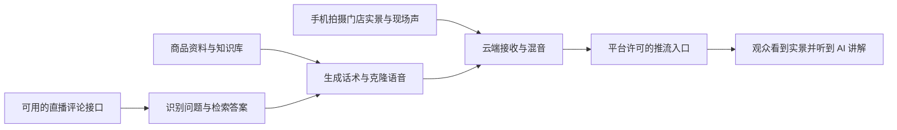

# 单手机 AI 实景直播调研

> 后续决定：用户已明确不做视频推流；本文保留为早期调研记录，其中推流架构与实施排序已不适用。当前路线及边界以 [网页播报方案](live-browser-audio-integration.md) 为准。

调研日期：2026-09-28。对象：用户提供的「星辰 AI 直播手机版」宣传图，以及可以供梧曜星枢参考的公开项目。

本次读取了项目 README、许可证、部分关键源码和移动系统官方文档，未安装这些项目、未下载模型、未登录第三方直播账号或实际开播。下文的“有实现”指公开代码或文档提供依据，不代表已通过真实直播联调。

## 结论

单手机拍实景、AI 持续讲解、插播观众问答，在工程上有可行路线。GitHub 上也有覆盖商品话术、声音克隆、循环播报、弹幕插播的项目，但本次未找到可以直接证明“普通单手机、完整开源、直接在抖音实景开播”的成品。

此前只围绕“向同机抖音 App 的麦克风注入 AI 声音”判断单手机方案，范围偏窄。自己的 App 采集摄像头、在本机或云端合成音轨、再通过平台许可的入口推流，也是可行路径。

没有查到足以核实「星辰」具体架构的公开技术资料，也没有找到该品牌与下列仓库的可靠关联。不能仅凭宣传图断言它采用云端混流、外放拾音或某个开源项目。

## 宣传功能可以怎样实现

| 宣传功能 | 可行的技术实现 | 目前可以确认的边界 |
|---|---|---|
| 导入商品后自动讲解 | 商品事实 + 讲解模板 → 大模型生成分段话术 → TTS 合成 → 播放队列 | 有公开项目实现类似流程。持续改写可以提前生成下一批话术，不一定每个字都临时生成 |
| 10 秒声音克隆 | 上传短参考音频，语音模型据此生成新文本的声音 | GPT-SoVITS 等已支持少量参考音频；“99% 还原”没有测评方法或样本，不能核实 |
| 多主播轮换 | 每个角色绑定音色、语速、话术风格，调度时切换 | 不需要多个模型一直独占运行；仍要评估切换自然度与合成延迟 |
| 知识库互动 | 直播事件 → 问题识别 → 本场/商品/门店知识检索 → 回答文本 → 语音插播 | 已有开源实现思路；弹幕获取、检索命中、播报时机是独立问题 |
| 云算力、一台手机 | 手机采集实景与现场声，服务端生成 AI 语音并混入输出流 | 技术上成立；需要验证实际平台接入条件，不等于任意账号都可用 |
| 月费 + 按小时收费 | 软件订阅，加语音计算、媒体处理、带宽等成本 | 定价不能反推出供应商采用的模型、GPU 或推流架构 |

一种值得我们验证的实现路线如下，**这是建议架构，不是星辰产品的已证实架构**：

另一种路线是在自己的手机 App 内混音后直接推流。它能减少云端视频处理，但仍需要移动端编码、音视频同步和平台推流入口。两条路线都不同于把 AI 声音写进另一个 App 的麦克风。

## 最相关的 GitHub 应用

| 项目 | 已核查能力 | 对梧曜星枢的价值 | 平台与许可边界 |
|---|---|---|---|
| [yuanfu999/live-commerce-assistant](https://github.com/yuanfu999/live-commerce-assistant) | 商品、AI 话术、循环播报、定时任务、弹幕互动；源码调用 GPT-SoVITS，并有插播队列 | 最贴近商品实景口播的业务流程 | PyQt6 电脑程序，pygame 输出声音；克隆代码含 Windows 固定路径。仓库未见 LICENSE，商业复用需取得许可 |
| [Ikaros-521/AI-Vtuber](https://github.com/Ikaros-521/AI-Vtuber) | 多平台互动、LLM、TTS/克隆、循环文案及动态改写 | 参考完整的自动讲解、欢迎感谢与问答流程 | 不是已验证的单手机方案。GPL-3.0；README 另写商用联系作者、抽成 10%，需澄清授权口径 |
| [lipku/LiveStream](https://github.com/lipku/livestream) | 话术循环、弹幕回复、知识库、高低优先级播放队列 | 参考“常规讲解继续补充、问答优先插播”的调度 | README 明确通过 OBS/直播伴侣抓屏或虚拟摄像头输出；未见 LICENSE |
| [saermart/DouyinLiveWebFetcher](https://github.com/saermart/DouyinLiveWebFetcher) | 抖音网页弹幕、点赞、礼物、入场事件 | 理解直播事件结构与采集流程 | 非官方开放 SDK，依赖网页协议。AGPL-3.0；README 另有非商业限制措辞，需澄清，不能直接视为闭源 SaaS 可自由复用组件 |

关键源码证据：

- LiveStream 的 [README](https://github.com/lipku/LiveStream/blob/cbcf825fd43bfc29d1afa177674a3ec855c02fd8/README.md) 明确描述“话术循环 + 弹幕插播 + 知识库”；[play_queue.py](https://github.com/lipku/LiveStream/blob/cbcf825fd43bfc29d1afa177674a3ec855c02fd8/backend/app/services/play_queue.py) 实现互动高优先级、常规话术低优先级、低水位补充。
- live-commerce-assistant 的 [voice_clone_engine.py](https://github.com/yuanfu999/live-commerce-assistant/blob/main/core/voice_clone_engine.py) 调用 GPT-SoVITS `/tts`；[tts_engine.py](https://github.com/yuanfu999/live-commerce-assistant/blob/main/core/tts_engine.py) 用 pygame 播放，后者只能证明电脑输出音频。
- AI-Vtuber 的 [动态文案逻辑](https://github.com/Ikaros-521/AI-Vtuber/blob/a285990e5f7dea30507d97572246cffe45a3c4ab/main.py#L1082) 读取文案、可选 LLM 改写、交给音频处理；[README](https://github.com/Ikaros-521/AI-Vtuber/blob/a285990e5f7dea30507d97572246cffe45a3c4ab/README.md#L34) 有商业授权说明。
- DouyinLiveWebFetcher 的 [liveMan.py](https://github.com/saermart/DouyinLiveWebFetcher/blob/40a904bdb0561a5a9c958a95634a29681cc4fbf4/liveMan.py#L238) 使用网页 WebSocket、签名等机制；这不是获得官方推流权限的方式。

补充参考：[Fay](https://github.com/xszyou/Fay) 适合语音交互与多终端编排；[LiveTalking](https://github.com/lipku/LiveTalking) 适合数字人画面。我们当前要拍门店实景，第一版无需先接入数字人渲染。

## 可选的基础组件

| 模块 | 候选 | 已核验能力与选择理由 |
|---|---|---|
| 中文声音克隆与语音合成 | [CosyVoice](https://github.com/FunAudioLLM/CosyVoice) | 中文/方言、零样本克隆、文本与音频流式处理；优先评估。代码 Apache-2.0，[Fun-CosyVoice3-0.5B-2512 模型卡](https://huggingface.co/FunAudioLLM/Fun-CosyVoice3-0.5B-2512) 亦标 Apache-2.0 |
| 声音效果对照 | [GPT-SoVITS](https://github.com/RVC-Boss/GPT-SoVITS) | 官方说明 5 秒参考音频零样本、1 分钟数据微调；[api_v2.py](https://github.com/RVC-Boss/GPT-SoVITS/blob/main/api_v2.py) 支持流式返回。代码 MIT，[官方链接模型集合](https://huggingface.co/lj1995/GPT-SoVITS) 标 MIT；其他依赖仍需按版本核验 |
| Android 摄像头采集推流 | [RootEncoder](https://github.com/pedroSG94/RootEncoder) | 摄像头、麦克风、RTMP/RTSP/SRT；Apache-2.0。[BufferAudioSource.kt](https://github.com/pedroSG94/RootEncoder/blob/master/encoder/src/main/java/com/pedro/encoder/input/sources/audio/BufferAudioSource.kt) 支持输入 PCM，可研究将 TTS 接入自己的推流音轨 |
| iOS 摄像头采集推流 | [HaishinKit.swift](https://github.com/HaishinKit/HaishinKit.swift) | 摄像头、麦克风、RTMP/SRT、ReplayKit；BSD-3-Clause，可作为 iPhone 自有推流端基础 |
| 云端流接收与转换 | [SRS](https://github.com/ossrs/srs) | RTMP/WebRTC/SRT 等协议；MIT。承担流接收和协议转换，混音单独处理 |
| 云端音频混合 | [FFmpeg](https://github.com/FFmpeg/FFmpeg) | [amix 文档](https://github.com/FFmpeg/FFmpeg/blob/master/doc/filters.texi) 明确支持多个输入合成一条音轨；实际部署按构建选项检查许可 |

不优先选择 [F5-TTS](https://github.com/SWivid/F5-TTS) 作为商业默认方案：代码虽为 MIT，但[官方模型权重](https://huggingface.co/SWivid/F5-TTS) 标注 CC-BY-NC-4.0，不能把代码许可直接套在权重上。

语音项目 README 的“150 ms”等数值属于特定模型和环境下的性能宣称，不是“收到弹幕到观众听见回答”的完整延迟。完整链路还包括平台事件、检索、生成、队列等待、推流和平台播放缓冲。

## 普通手机的音频能力到底限制在哪里

| 路线 | 官方文档或源码能证明什么 | 不能直接推导什么 |
|---|---|---|
| Android 捕获其他 App 的播放音 | [AudioPlaybackCapture](https://developer.android.google.cn/media/platform/av-capture?hl=en) 可复制允许捕获的播放音，受用户授权、音频用途和播放方策略限制 | 不能等同“把音频注入抖音麦克风” |
| 两个普通 App 同时录音 | [Sharing audio input](https://developer.android.google.cn/media/platform/sharing-audio-input?hl=en) 描述输入优先级，部分情形一个 App 得到静音 | 不能假设后台录音与抖音录音可长期同时工作；也不能推导为播放与录音绝对不能同时工作 |
| AI 外放、直播麦克风拾音 | 声学路径在部分设备可能工作；[音频焦点规则](https://developer.android.google.cn/media/optimize/audio-focus?hl=en) 会影响持续播放 | 不能承诺所有手机都不暂停、不回声、不被降噪消除 |
| Android REMOTE_SUBMIX | [AOSP 源码](https://github.com/aosp-mirror/platform_frameworks_base/blob/master/media/java/android/media/MediaRecorder.java) 要求系统级 CAPTURE_AUDIO_OUTPUT 权限 | 不能当作普通第三方 App 通用的虚拟麦克风 |
| iOS ReplayKit | [官方文档](https://developer.apple.com/documentation/replaykit) 支持屏幕、App 音频和麦克风的采集广播 | 不能证明能写入任意其他 App 的麦克风 |
| 自己 App/云端合成推流 | RootEncoder、HaishinKit 和 FFmpeg 为采集、编码、混音提供基础 | 不自动提供抖音推流地址、商品挂载或直播评论权限 |

因此，“单手机”可以成立，但需要了解它用的是自有摄像头界面、抖音相机直播、录屏直播、外放拾音，还是厂商特定能力。宣传图没有给出这些信息。

## 抖音官方接口的公开依据

本次没有找到官方公开依据，能确认普通商家凭已有直播权限，就可以从任意第三方 App 或云端向抖音推流；也没有确认面向普通商家直播间的通用实时弹幕接口。这是尚未验证，不是断言接口不存在。

- [移动/网站应用 OpenAPI 列表](https://developer.open-douyin.com/docs/resource/zh-CN/dop/develop/openapi/list)：本次读取的公开列表没有列出通用的创建直播间、获取推流地址或实时直播评论接口。
- [Webhooks 概述](https://developer.open-douyin.com/docs/resource/zh-CN/dop/develop/webhooks/summarize)：用户须授权相应 scope，开发者配置回调并订阅具体事件；存在 Webhooks 不等于任意直播评论均可订阅。
- [能力实验室概述](https://developer.open-douyin.com/docs/resource/zh-CN/developer/introduction/Capability-Lab-Overview)：能力受申请、审核、开放周期与可见范围影响。公开目录中未列出，不能排除定向开放或合作能力。

需要根据目标账号和开发者身份核实实际可申请的能力。截图供应商是否具备特定合作资格，同样没有公开证据。

## 对梧曜星枢的实施建议

现有商品库、知识库、多门店、直播草稿与知识快照可以保留。当前后端的场次 `/start` 是业务状态变化，不代表已建立真实平台直播连接，参见 [已有联调说明](products-knowledge-live-integration.md)。

建议把真实直播能力作为独立模块接入：现有 Java 后端管理门店、商品、会话与供应商配置；语音服务负责克隆/TTS；播报调度负责常规讲解和问答插播；移动采集端与媒体服务负责画面、声音及连接状态。大模型与语音供应商均保留可替换接口。

验证顺序：

1. **先确认目标账号的可用推流入口及业务能力。** 能用抖音 App 直播，不能直接推定有第三方推流接口；团购券/小黄车与评论获取也需要分别确认。
2. **先做一台手机的真实画面 + 一段固定测试音频。** 测试声音是否到达观众端、画面是否仍是门店实景、静音外放后是否仍有声音、是否需要电脑或配件。这一步不需要大模型。
3. **接入 TTS 和参考声音。** 用同一批中文商品话术比较自然度、专有词读音、首段耗时、持续生成速度和成本。再决定托管 API 或独立 GPU 服务。
4. **接入连续播报。** 分段预生成，保持有限缓冲；支持暂停、跳过、断线恢复和播放确认，避免声音断档及旧话术堆积。
5. **接入弹幕与知识回答。** 沿用本场、商品、门店知识的来源优先级；互动去重、过期淘汰、插播后恢复常规讲解。检索与真实播报分别记录状态。

最优先的技术验证是“画面和 AI 音轨如何进入目标平台”。在此之前大规模搭建 GPU、克隆服务和完整手机 App，可能无法解决最终的平台接入问题。

## 如果能拿到对方演示，需要核实的内容

- 从手机桌面开始，展示选择账号到观众端收到画面和声音的完整过程，确认开播使用哪个 App。
- 是否支持 iPhone；Android 是否限制品牌、系统版本、耳机/声卡或其他配件。
- 关闭扬声器音量后，另一台观众设备是否仍能听到 AI；确认是否只是外放拾音。
- 直播间是否能挂团购券/商品，现场提问是否能依据刚修改的商品资料回答。
- 断网恢复、来电、切到后台时怎样表现；长时间运行是否出现声音间断、延迟增长或画面掉帧。

这些证据可以区分实现路线。目前公开源码足以帮助设计大部分 AI 播报功能，但无法替代对该供应商和目标抖音账号的实际验证。
